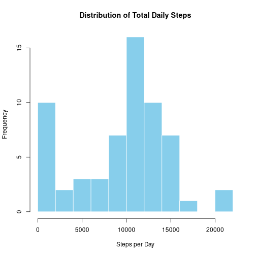
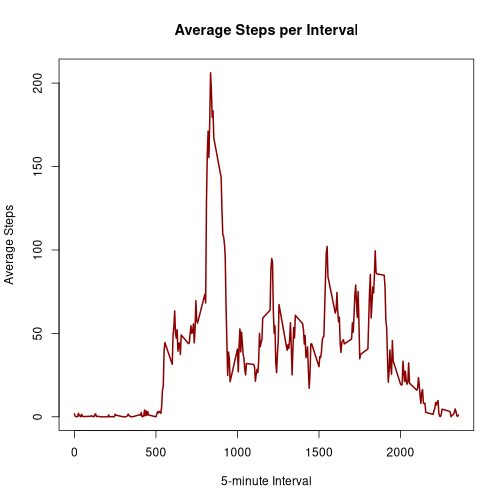
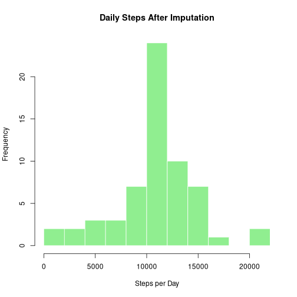
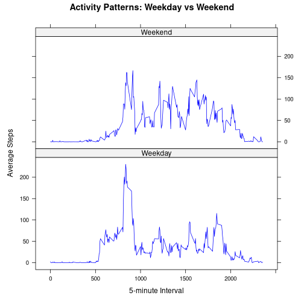

## Loading and Preparing the Dataset


``` r
activity_data <- read.csv("activity.csv", stringsAsFactors = FALSE)
activity_data$date <- as.Date(activity_data$date)
```

---

## Mean Total Number of Steps Taken Per Day


``` r
# Compute total steps per day (ignoring NA)
daily_totals <- tapply(activity_data$steps,
                       activity_data$date,
                       sum,
                       na.rm = TRUE)

daily_totals <- as.numeric(daily_totals)
```


``` r
hist(daily_totals,
     col = "skyblue",
     border = "white",
     main = "Distribution of Total Daily Steps",
     xlab = "Steps per Day",
     breaks = 15)
```




``` r
avg_steps <- mean(daily_totals)
med_steps <- median(daily_totals)

avg_steps
```

```
## [1] 9354.23
```

``` r
med_steps
```

```
## [1] 10395
```

The average number of steps per day is 9354.2295082.  
The median number of steps per day is 1.0395 &times; 10<sup>4</sup>.

---

## Average Daily Activity Pattern


``` r
interval_means <- tapply(activity_data$steps,
                         activity_data$interval,
                         mean,
                         na.rm = TRUE)

interval_values <- as.numeric(names(interval_means))
interval_means <- as.numeric(interval_means)
```


``` r
plot(interval_values,
     interval_means,
     type = "l",
     lwd = 2,
     col = "darkred",
     xlab = "5-minute Interval",
     ylab = "Average Steps",
     main = "Average Steps per Interval")
```




``` r
peak_interval <- interval_values[which.max(interval_means)]
peak_interval
```

```
## [1] 835
```

The interval with the highest average steps is 835.

---

## Handling Missing Values


``` r
missing_count <- sum(is.na(activity_data$steps))
missing_count
```

```
## [1] 2304
```

There are 2304 missing observations.

### Imputation Strategy

Missing values are replaced with the mean for their corresponding 5-minute interval.


``` r
# Create copy
filled_data <- activity_data

# Create lookup table
interval_lookup <- tapply(filled_data$steps,
                          filled_data$interval,
                          mean,
                          na.rm = TRUE)

# Replace NA using vectorized approach
na_indices <- which(is.na(filled_data$steps))

filled_data$steps[na_indices] <- 
  interval_lookup[as.character(filled_data$interval[na_indices])]
```

---


``` r
daily_totals_filled <- tapply(filled_data$steps,
                              filled_data$date,
                              sum)

daily_totals_filled <- as.numeric(daily_totals_filled)
```


``` r
hist(daily_totals_filled,
     col = "lightgreen",
     border = "white",
     main = "Daily Steps After Imputation",
     xlab = "Steps per Day",
     breaks = 15)
```




``` r
new_mean <- mean(daily_totals_filled)
new_median <- median(daily_totals_filled)

new_mean
```

```
## [1] 10766.19
```

``` r
new_median
```

```
## [1] 10766.19
```

The mean after imputation is 1.0766189 &times; 10<sup>4</sup>.  
The median after imputation is 1.0766189 &times; 10<sup>4</sup>.

Imputing missing values slightly adjusts the distribution but does not significantly change the overall pattern.

---

## Weekday vs Weekend Comparison


``` r
filled_data$day_category <- ifelse(weekdays(filled_data$date) %in% 
                                     c("Saturday", "Sunday"),
                                   "Weekend",
                                   "Weekday")

filled_data$day_category <- factor(filled_data$day_category)
```


``` r
library(lattice)

interval_day_avg <- aggregate(steps ~ interval + day_category,
                              data = filled_data,
                              FUN = mean)

xyplot(steps ~ interval | day_category,
       data = interval_day_avg,
       type = "l",
       layout = c(1, 2),
       col = "blue",
       xlab = "5-minute Interval",
       ylab = "Average Steps",
       main = "Activity Patterns: Weekday vs Weekend")
```


